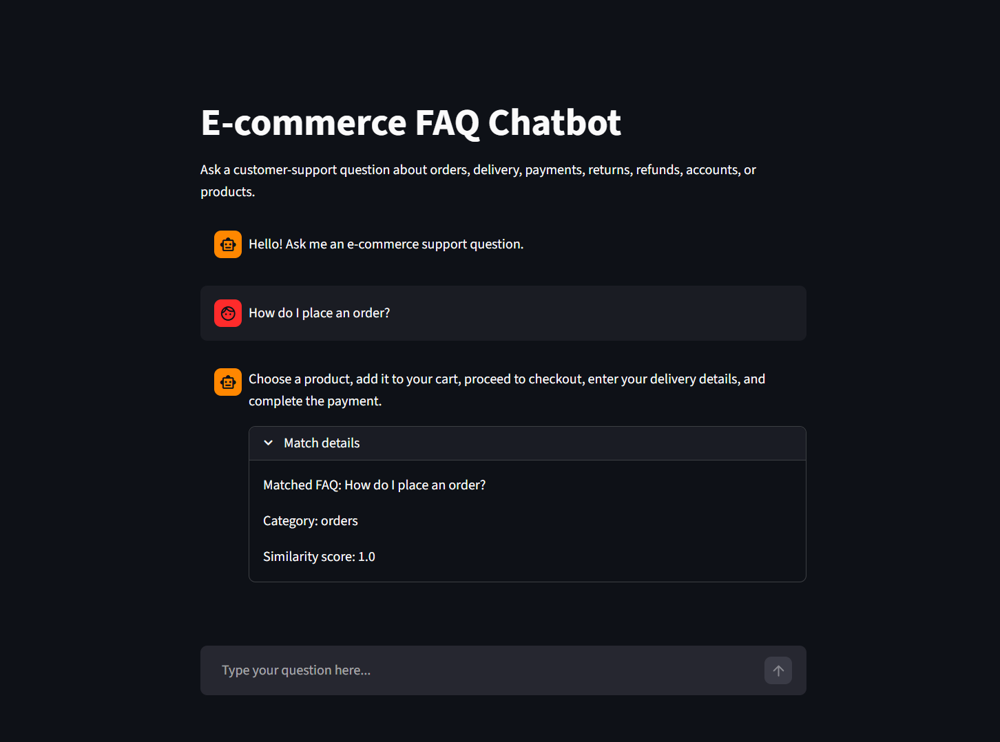
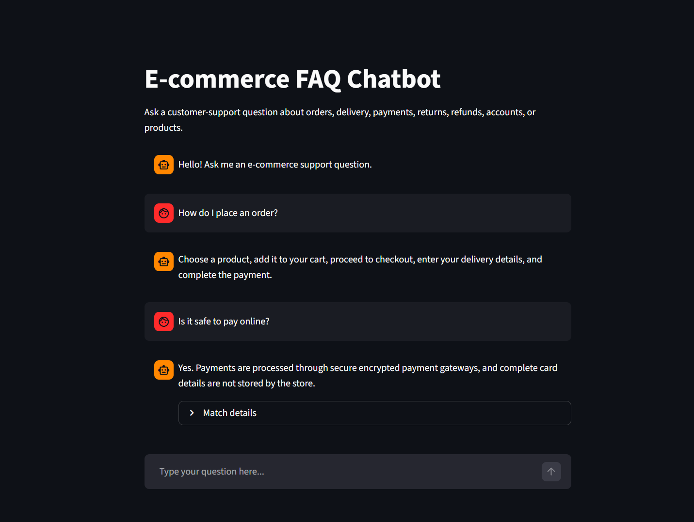

# E-commerce FAQ Chatbot

E-commerce FAQ chatbot built with Python, NLP, TF-IDF, cosine similarity, and Streamlit.

This internship project answers common e-commerce customer-support questions by matching a user's message with the most similar question in an FAQ dataset.

## Live Demo

[Open the deployed Streamlit app](https://ecommerce-faq-chatbot-sr.streamlit.app/)

## Screenshots





## Demo Video

[Watch the screen recording](media/chatbot-demo-video.mp4)

## Tech Stack

- Python
- NLTK
- scikit-learn
- Streamlit

## Project Workflow

```text
User question
      ↓
Text preprocessing
      ↓
TF-IDF vectorization
      ↓
Cosine similarity matching
      ↓
Best FAQ answer
      ↓
Streamlit chat response
```

## Step 1: FAQ Dataset

The starter dataset is stored in `data/faqs.csv`. It contains 30 question-and-answer pairs across these categories:

- Orders
- Shipping
- Payments
- Returns
- Refunds
- Accounts
- Products

Each record contains an `id`, `category`, `question`, and `answer`.

## Step 2: Text Preprocessing

The `preprocess.py` file loads the FAQ CSV and prepares question text for similarity matching.

It performs:

- Lowercasing
- Punctuation removal
- Tokenization using NLTK
- Stop-word removal
- Stemming using NLTK's `PorterStemmer`

Run it with:

```bash
python preprocess.py
```

## Step 3: FAQ Matching

The `chatbot.py` file matches a user's question with the most similar FAQ question.

It uses:

- `TfidfVectorizer` from scikit-learn to convert text into numerical vectors
- `cosine_similarity` to compare the user question with every FAQ question
- A similarity threshold so the bot can avoid giving weak or unrelated answers

Run it with:

```bash
python chatbot.py
```

Example:

```text
You: Where is my package?
Bot: Open My Orders and select Track Package. You will also receive a tracking link by email or SMS after shipment.
Matched FAQ: How can I track my package?
Similarity score: 0.59
```

## Step 4: Testing

The `test_chatbot.py` file runs the chatbot against sample customer questions.

Run:

```bash
python test_chatbot.py
```

This helps check whether the chatbot is matching user questions with the correct FAQ. It also includes one unrelated question so you can show how the threshold handles unknown queries.

## Step 5: Chat UI

The `app.py` file provides a simple Streamlit chat interface.

Run:

```bash
streamlit run app.py
```

The UI lets users type questions, view chatbot answers, and open match details to see the matched FAQ, category, and similarity score.

## Run Locally

Install dependencies:

```bash
pip install -r requirements.txt
```

Start the app:

```bash
python -m streamlit run app.py
```
Made with 💗 by SR
